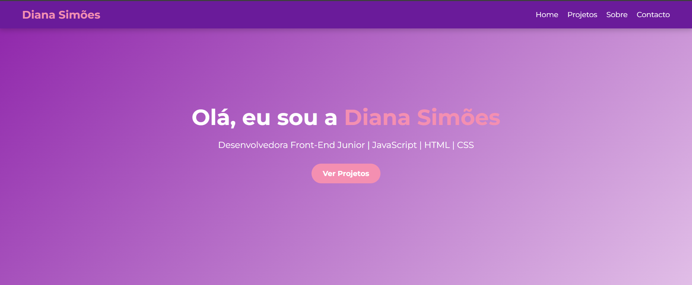

# 🌐 Portfólio – Diana Simões

Portfólio pessoal desenvolvido para apresentar meus projetos, habilidades e experiência como Desenvolvedora Front-End.

🔗 **Acesse o site:** https://abiliaframboesa.github.io/portfolio/

---

## ✨ Funcionalidades
- Layout moderno e responsivo
- Animações suaves com IntersectionObserver
- Seção de projetos com links para demo e código
- Formulário de contacto
- Design focado em UX/UI

---

## 🛠️ Tecnologias Utilizadas
- HTML5
- CSS3 (Flexbox, Grid, Animações)
- JavaScript (ES6+)
- Git & GitHub Pages

---

## 📊 Performance
- Performance: 95+
- Acessibilidade: 90+
- SEO: 90+

(Testado com Lighthouse)

---

## 📸 Preview


---

## 🚀 Como executar localmente
```bash
git clone https://github.com/abiliaframboesa/dianacsimoes.github.io
cd dianacsimoes.github.io
open index.html
